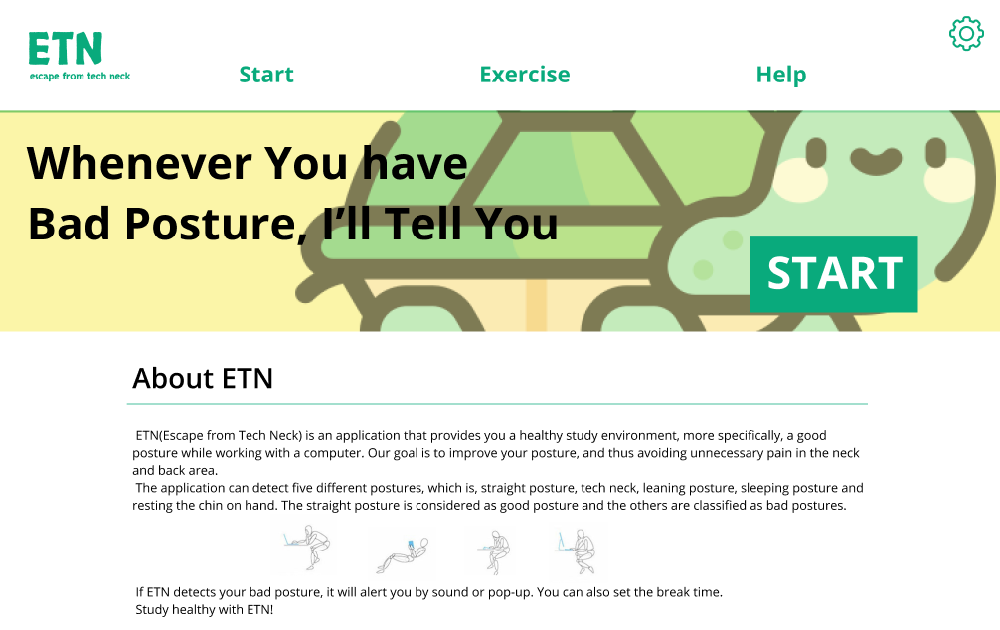
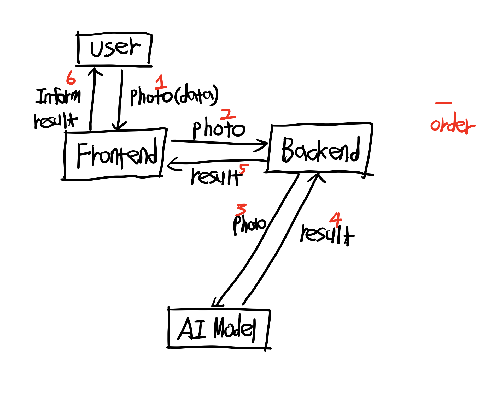
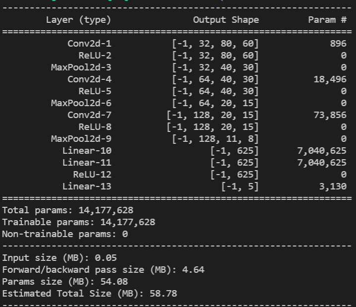
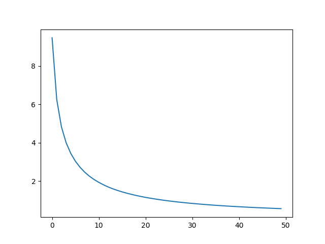
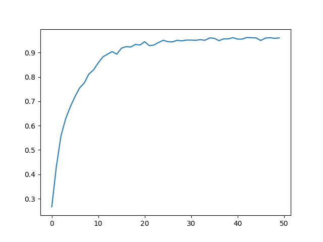

# Escape-from-tech-neck

  

This is for CSED 402 Class in 2021 fall.

Our applicaction's main task is that informing people whether their sitting posture is good or not.
For it, we trained AI model using about 1000 pieces of our own dataset.

The order of execution of our application is as follows.

1. When user enter our application, user decides some setting of our application like sensitivity of our model, location of camera, etc...
2. When the user is sitting in front of the computer, the webcam located to the right of the user takes a picture of the user's side.(per 5 sec)
3. The picture of user is given to our trained AI model, and the model gives whether his or her sitting posture is good or not.
4. If bad posture is maintained for a long time, our app will remind users that "you're in bad posuture".

By using this app, we expect that you will be able to maintain a better posture when working at the computer, thereby keeping your back and neck healthy and escape from tech neck!

# Abstract
  
Our application's flow chart is like this.
(SOME EXPLANATION WILL BE ADDED)
  
# AI
Input data for model is photos of people's postures and labels for it.
We made 5 kinds of label for classifying.
|Label|Sitting posture|
|--|--|
|0|Good posture|
|1|Tech_Neck|
|2|Leaning|
|3|Sleeping|
|4|Resting chin|

Our model's task is choosing which posture is for given photo.
For it, we are using very simple model now.(it can be changed.)

We use about 1000 pieces of our own generated data. For it, we used `/data/record.py`

Our model's performance is like this.(Loss & Accuracy)

# Frontend
WILL BE ADDED
# Backend
WILL BE ADDED
